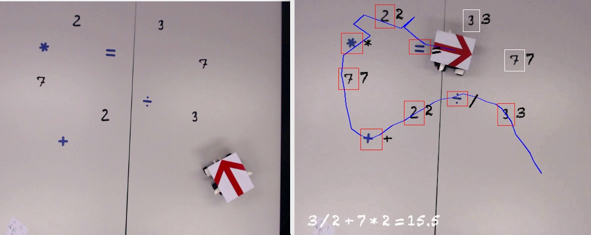

# Image Analysis and Pattern Recognition Project

## Introduction:

This project is in the context of IAPR Course at EPFL, 
In this special project, the task is to use image analysis skills to analyse the behaviour of a Lego​© Mindstorm​© robot in a specific environment. The environment is a flat arena of approximately 3 meters by 3 meters containing visual elements such as different mathematical operators and handwritten digits with different colors. 

The exact position and orientation of these elements may vary. In this project, we use recordings of the environment by a camera mounted above the arena and pointed directly at the arena, such that the plane of the arena is parallel to the image plane of the camera.



- Main task is to find the result of an equation based on a video sequence, as well, plotting the trajectory of the robot.

# Requirements:
```
pip install -r requirements.txt
```

# Usage:
```
python  main.py --input /path/to/input/video.avi --output /path/to/your/result.avi
```

***Video :***  ".avi" format, recorded at 2 FPS

***Team Members:*** 
- Imad Eddine MAROUF
- Duvieusart Arnaud Jean Pierre-François Brigitte
- Mert Ertuğrul
